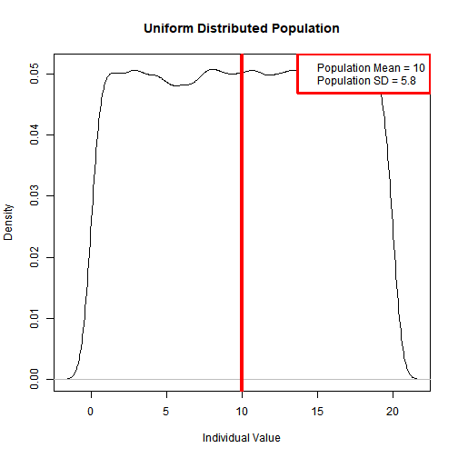
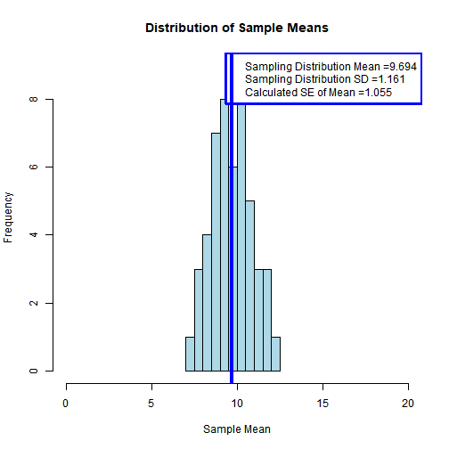

Developing Data Products Final Presentation
========================================================
author: Mark De La Mater
date: May 3, 2018
autosize: true


<p style="text-align: center;"> 

Exploring the Central Limit Theorem

</p>

The code for the shiny app and the code for this presentation can be found at https://github.com/mdlm1951/Shiny_App

Project Overview
===


 1. The goal of the project was to provide an easy to use simulation tool for exploring the Central Limit Theorem <b>(CLT)</b>
 2. The practial aspect we chose to focus on was the visible influcence of the CLT when sampling from popultions where the underlying population distribution is other than normal
 3. The approach taken was to provide a simulated <b>"Experimental Workbench"</b> where a student can simulate a sampling experiment by:
+ Selecting an underlying <b>Population</b> from which to sample
+ Selecting the <b>Sample Size</b>
+ Selecting the <b>Number of Samples</b> for replication


Screen Shot of Simulation Interface
========================================================


Key Elements of the R Code
========================================================

Creating the underlying Populations

```r
set.seed(12345)
target_mean <- 10
target_sd <- 2
pop_norm <- rnorm(100000, target_mean, target_sd)
pop_unif <- runif(100000, 0, (2 * target_mean))
pop_chix <- rchisq(100000, target_mean)
```

***

Simulating Sampling from a Population

```r
sample_distribution <- function(population, samp_size, num_samps) {
  results <- numeric(num_samps)
  for (i in 1:num_samps) {
    samp <- sample(population, size = samp_size, replace = FALSE)
    samp_mean <- mean(samp)
    results[i] <- samp_mean
  }
  return(results)  
}  ## End Function
```


Example of Output from R Code
========================================================
<small>Plot of Population Distribution</small>


***
<small>Histogram of Sample Distribution</small>



